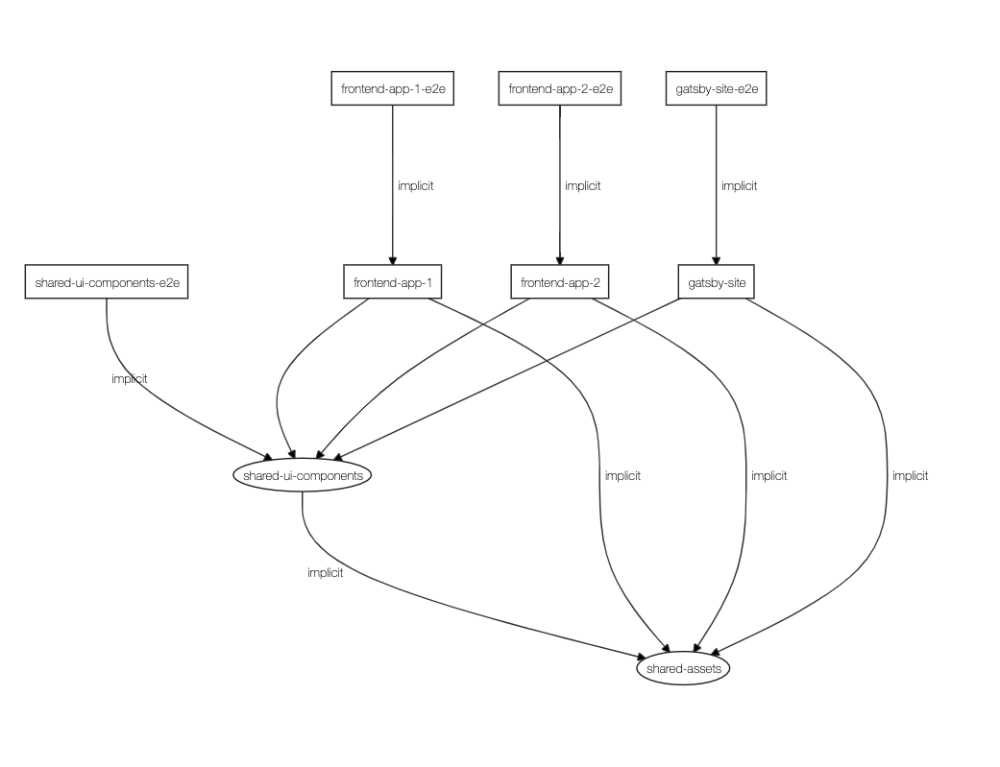

# NxFrontends

This project was generated using [Nx](https://nx.dev).

ℹ️&nbsp;&nbsp;use the node.js v12.16.1 LTS

🌎&nbsp;&nbsp;[Pipelines (builds) on MS Azure DevOps](https://dev.azure.com/ErkoBrideeAzure/nx-frontends/_build)

## Goal

- create 2 simple frontend application using react, have one a shared assets lib and a shared ui components lib used from both of the applications

- master how to define and use the [Azure DevOps Services | Microsoft Azure](https://dev.azure.com/) CI/CD pipelines as code ([YAML](https://yaml.org/))

- integrate the gatsby support and identify how to use it

## Documentation

- [Dev environment known issues](docs/dev-env-known-issues.md)

- [Nx](docs/nx.md)

  - [Nx Gatsby Plugin](docs/nx-gatsby-plugin.md)

- [Project creation commands (steps)](docs/project-creation-commands.md)

- [Build and release flows](docs/build-release-flow/README.md)

  - [Proposed idea](docs/build-release-flow/proposed-idea.md)

  - [Using the Microsoft Azure DevOps](docs/build-release-flow/azure-devops.md)

    - [Pipelines flows](docs/build-release-flow/azure-devops_pipelines-flows.md)

    - [Load `.yml` pipeline into Azure DevOps](docs/build-release-flow/azure-devops_load-yml-pipeline.md)

    - [Trigger pipeline over a REST API call](docs/build-release-flow/azure-devops_rest-api_trigger_pipeline.md)

  - [Create and use a GitHub PAT](docs/build-release-flow/github-pat.md)

## Project dependencies graph

> **implicit** - means kind of manual mapping

## Findings

- it's possible to have more flexible libs

  - create an assets lib to share the SASS (.scss) common files and also the images, which is a folder with the given content needed inside (no ts or other nx lib stuff related inside of it)

  - have a component lib that expose the whole content of itself and with that gain more flexibility to access the shared components from others libs or applications

- it's possible to use the gatsby inside of the nx workspace, but it demands a bit of some extra manual steps to map the paths alias that will be used on the code and with that avoid to handl e the relative imports (avoid the need of this: `../..`)
