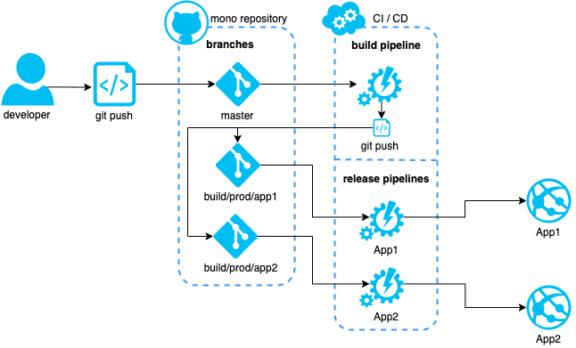

# CI / CD server

[⬅️ README](../README.md)

> this server could be Jenkins, Azure DevOps or other

## Proposed idea

> Ideas to CI (build) and CD (release) jobs flow. Based on the concept of how Github deploys a static web app from the `gh-pages` branch.

> the following example is based on builds and release to the production environment, so a push to the `master` branch will trigger the CI/CD flow

1. The developer push the code to the branch
2. Triggers the CI build pipeline calls the taks from the project `npm install`, `build` and `git-push`, this last one will get the content from the build output and create/update auxiliary branches with the content of the build of each application from the mono repository
3. To each application inside of the mono repository, we should have a release job to handle the deployment of that given application. That job will get the content from the auxiliary branch with the build of the application and send it to the respective application server

## Further help

- [Support for generic task execution, displaying affecting projects, new commands for schematics discovery, and more in Nx 8.7 | Nrwl](https://blog.nrwl.io/support-for-generic-task-execution-displaying-affecting-libraries-new-commands-for-schematics-1b62b444ad0e)

- [Build Affected Apps | Nx Docs](https://nx.dev/react/tutorial/11-build-affected-projects)

  - [Rebuilding and Retesting What is Affected | Nx Docs](https://nx.dev/react/guides/monorepo-affected)

- [Blazing Fast Distributed CI with Nx | Nrwl](https://blog.nrwl.io/blazing-fast-distributed-ci-with-nx-a1f5974f7393)

  - [[GitHub] nrwl/nx-azure-build](https://github.com/nrwl/nx-azure-build) - Example of setting up distributed Azure build for Nx workspace

- [Azure DevOps YAML build for Mono Repository with multiple projects](https://dev.to/nikolicbojan/azure-devops-yaml-build-for-mono-repository-with-multiple-projects-146g) - project example at [[GitHub] nikolic-bojan/azure-yaml-build](https://github.com/nikolic-bojan/azure-yaml-build)
