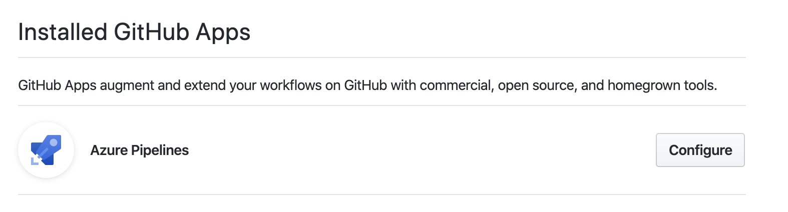

[⬅️&nbsp;&nbsp;Build and Release Flow](README.md)

[⬅️&nbsp;&nbsp;README](../../README.md)

# Microsoft Azure DevOps

**Assumptions:**

- have installed the [Azure Pipelines application](https://github.com/marketplace/azure-pipelines) on the GitHub repository

- have 2 environments (servers) per application from the mono repository, production (code from the `master` branch) and development (code from the `develop` branch)

- an application (_static application based on the React_) will be deployed on the Microsoft Azure Cloud and it will use a storage and a CDN (with it own URL domain)

## Goal

- Handle the build and release flows to a mono repository

  - Follow the [proposed idea](proposed-idea.md)

- Have the pipelines definitions as code ([YAML](https://yaml.org/) files) inside of the repository on the `.azure-pipelines`

  - avoid code duplication using the [Azure Pipelines Templates](https://docs.microsoft.com/en-us/azure/devops/pipelines/process/templates?view=azure-devops)

* Have 2 types of pipeline flows, build and release

  - **build** - push the build to an auxiliary build branch

    - triggered automatically (CI - continuous integration) by any commit on the `master` or `develop` branch, or by any pull request created which the target is the `develop` branch

    - triggered manually, to build all the applications or to a single application

  - **release**

    - one pipeline per environment and application, triggered by any commit on the auxiliary build branch (CD - continuous deployment)

## Topics

- [Pipelines flows](azure-devops_pipelines-flows.md)

- [Load `.yml` pipeline into Azure DevOps](azure-devops_load-yml-pipeline.md)

## Further help

- [Azure DevOps](https://azure.microsoft.com/en-us/services/devops/)

  - [Azure DevOps - Marketplace](https://marketplace.visualstudio.com/azuredevops)

- [Create Azure DevOps account | Sergey .NET](https://sergeydotnet.com/create-azure-devops-account/)

- [Azure DevOps Labs](https://www.azuredevopslabs.com/)

- [Get started documentation | Azure DevOps | Microsoft Docs](https://docs.microsoft.com/en-us/azure/devops/get-started/?view=azure-devops)

- [Quickstart: Create an organization or project collection | Azure DevOps | Microsoft Docs](https://docs.microsoft.com/en-us/azure/devops/organizations/accounts/create-organization?view=azure-devops)

- [Azure DevOps Pipelines: Depends On with Conditionals in YAML | Eric L. Anderson](https://elanderson.net/2020/05/azure-devops-pipelines-depends-on-with-conditionals-in-yaml/)

### Azure Resource Manager templates

- [Azure Resource Manager templates overview | MS Docs](https://docs.microsoft.com/en-us/azure/azure-resource-manager/templates/overview)

- [Tutorial: Create and deploy your first Azure Resource Manager template | MS Docs](https://docs.microsoft.com/en-us/azure/azure-resource-manager/templates/template-tutorial-create-first-template?tabs=azure-powershell)

- [Understand the structure and syntax of Azure Resource Manager templates | MS Docs](https://docs.microsoft.com/en-us/azure/azure-resource-manager/templates/template-syntax)

- [Azure Quickstart Templates](https://azure.microsoft.com/en-us/resources/templates/)

  - [[GitHub] Azure / azure-quickstart-templates](https://github.com/Azure/azure-quickstart-templates)

### Mono Repository

- [Blazing Fast Distributed CI with Nx | Nrwl](https://blog.nrwl.io/blazing-fast-distributed-ci-with-nx-a1f5974f7393)

  - [[GitHub] nrwl/nx-azure-build](https://github.com/nrwl/nx-azure-build) - Example of setting up distributed Azure build for Nx workspace

- [Azure DevOps YAML build for Mono Repository with multiple projects](https://dev.to/nikolicbojan/azure-devops-yaml-build-for-mono-repository-with-multiple-projects-146g)

  - [[GitHub] nikolic-bojan/azure-yaml-build](https://github.com/nikolic-bojan/azure-yaml-build)
