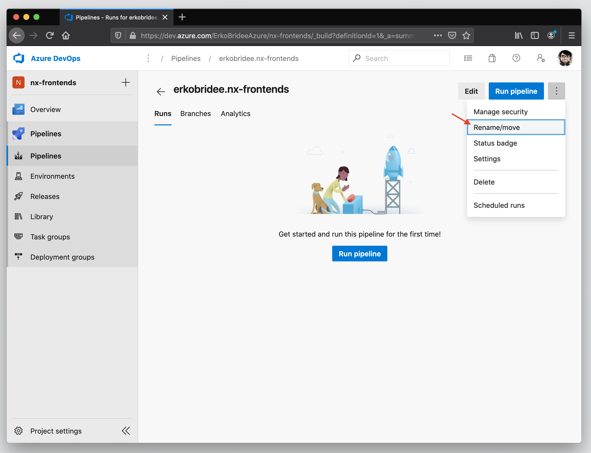

[⬅️ Microsoft Azure DevOps](azure-devops.md)

[⬅️ Build and Release Flow](README.md)

[⬅️ README](../../README.md)

# Microsoft Azure DevOps load `.yml` pipeline

## Steps

> The following steps shows how to setup the _**CI branches**_ on the Azure DevOps, loading the `.yml`pipeline definition 📄[.azure-pipelines/ci/brances.yml](../../.azure-pipelines/ci/branches.yml)
>
> Keep in mind: to setup the others pipelines, just follow the sames steps bellow.

### Step 0

### Step 1

### Step 2

### Step 3

### Step 4

### Step 5

### Step 6

### Step 7

### Step 8

### Step 9

### Step 10

### Done

## Further help

- [Working with Azure DevOps Pipelines in YAML - James Pearson](https://jpearson.blog/2019/05/21/working-with-azure-devops-pipelines-in-yaml/)

- [Moving your Azure DevOps build pipelines to your code repository](https://blog.bredvid.no/moving-your-azure-devops-build-pipelines-to-your-code-repository-dff60488c0f9)

- [Configuring CI/CD Pipelines as Code with YAML in Azure DevOps](https://azuredevopslabs.com/labs/azuredevops/yaml/)

- [Azure DevOps YAML build for Mono Repository with multiple projects](https://dev.to/nikolicbojan/azure-devops-yaml-build-for-mono-repository-with-multiple-projects-146g)

  - [[GitHub] nikolic-bojan/azure-yaml-build](https://github.com/nikolic-bojan/azure-yaml-build) - Sample of Azure DevOps Build Pipeline with YAML
