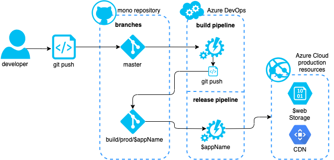
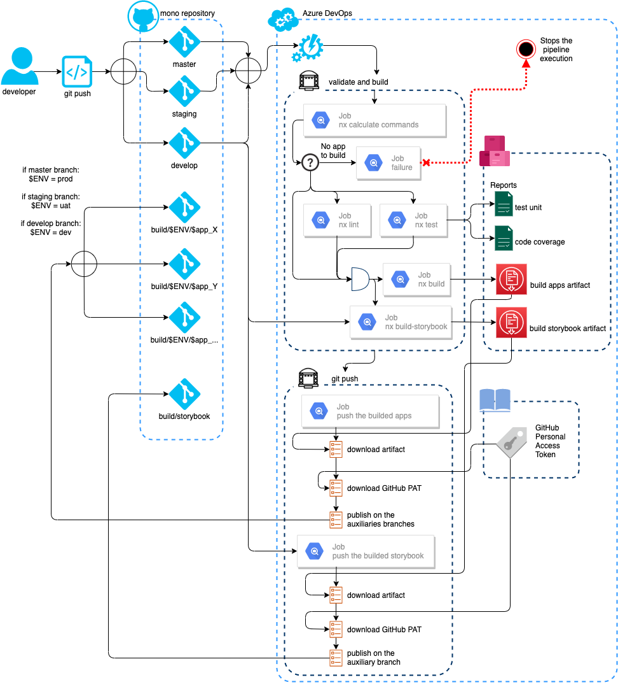
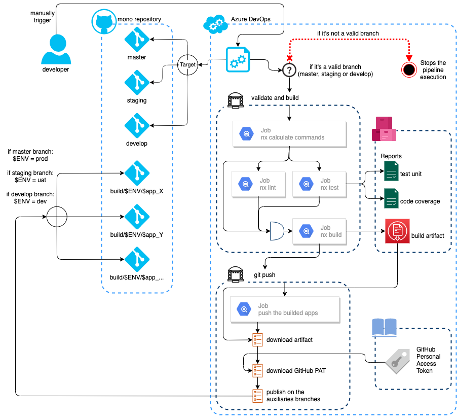
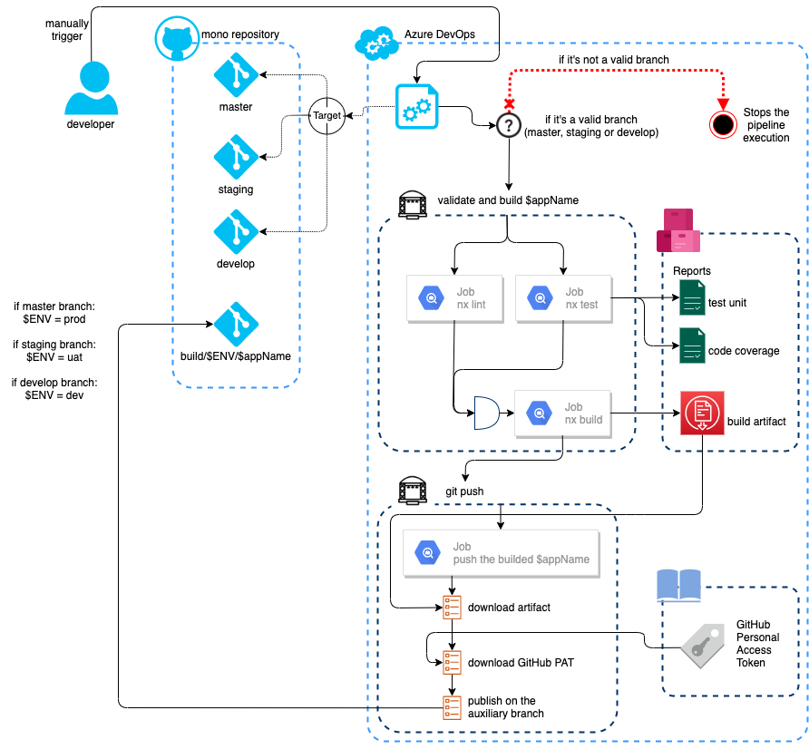
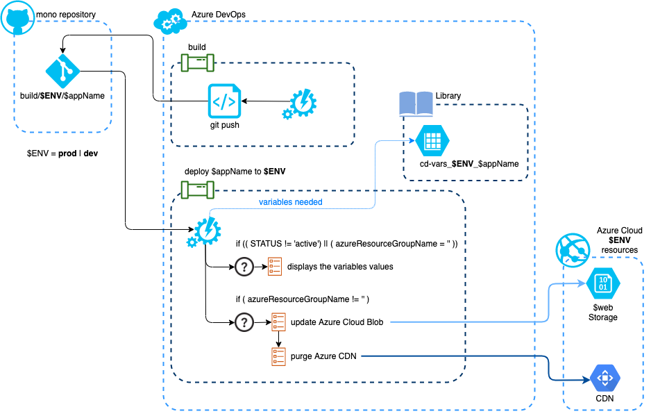

[⬅️&nbsp;&nbsp;Microsoft Azure DevOps](azure-devops.md)

[⬅️&nbsp;&nbsp;Build and Release Flow](README.md)

[⬅️&nbsp;&nbsp;README](../../README.md)

# Microsoft Azure DevOps Pipelines flows

> all the pipelines definitions and its templates they're defined inside of the directory **[.azure-pipelines](../../.azure-pipelines)**

## Abastract flow

> view to a single application from inside of the mono repository

### Build and deploy to development server

### Build and deploy to production server

## Build Flows

### CI (Continuous Integration) flows

#### Pull Request

> Triggered when there is any new pull request that targets the **develop** branch
>
> The main goal of this pipeline is to validate the code from the pull request

📝&nbsp;&nbsp;**.azure-pipelines/ci/pull-requests.yml**

#### Branches

> Triggered when there is any `git push` to the **master** or **develop** branch
>
> This pipeline will run the validation, build and branch build publish of the applications that needs to be executed

📝&nbsp;&nbsp;**.azure-pipelines/ci/branches.yml**

⚠️&nbsp;&nbsp;to run this pipeline you must have created a GitHub PAT and upload it to the Azure DevOps Pipelines Library as a Secure file. **Instructions:** [Create and use a GitHub PAT](github-pat.md)

### Manually triggered flows

> Like the name suggests, this following flow will be triggered manually by the developer on the Azure DevOps

#### Build all applications

📝&nbsp;&nbsp;**.azure-pipelines/manually/build-all.yml**

⚠️&nbsp;&nbsp;to run this pipeline you must have created a GitHub PAT and upload it to the Azure DevOps Pipelines Library as a Secure file. **Instructions:** [Create and use a GitHub PAT](github-pat.md)

#### Build one application

It should be created one by application and use the template **.azure-pipelines/manually/templates/build-one.yml**

⚠️&nbsp;&nbsp;to run this pipeline you must have created a GitHub PAT and upload it to the Azure DevOps Pipelines Library as a Secure file. **Instructions:** [Create and use a GitHub PAT](github-pat.md)

## Release Flows

> CD - Continuous Deployment

It should be created one by application, environment (`prod` - production or `dev` - development) and use the template **.azure-pipelines/cd/templates/deploy-one.yml**

⚠️&nbsp;&nbsp;to run this pipeline you must have created two variable groups on the pipelines library (remember to allow the access to all the pipelines):

- `cd-vars_commons` it will be used to all CD (**_continuous deployment_**) pipelines
  - `azureSubscriptionID` - the subscription ID
  - `azureSubscriptionResource` - the MS Azure DevOps service connection name
- `cd-vars_$ENV_$appName` which should contains
  - `STATUS` - it must have the value `active` to update the Azure Cloud Storage and Azure Could CDN
  - to update the storage
    - `azureStorageName`
  - to update the cdn
    - `azureResourceGroupName` - name of the service connection added to the `Service connections` under the MS Azure DevOps project settings
    - `azureCdnEndpointName`
    - `azureCdnProfileName`

## Further help

### Azure Pipelines

- [Learn to Use Variable Groups in Azure DevOps Pipelines | @slalom](https://medium.com/slalom-technology/learn-to-use-variable-groups-in-azure-devops-pipelines-203a485b4731)

- [YAML Release Pipelines in Azure DevOps | Microsoft Azure](https://azure.microsoft.com/en-us/resources/videos/build-2019-yaml-release-pipelines-in-azure-devops/)

- [Azure Pipelines documentation | Azure DevOps | Microsoft Docs](https://docs.microsoft.com/en-us/azure/devops/pipelines/?view=azure-devops)

  - [YAML schema reference](https://docs.microsoft.com/en-us/azure/devops/pipelines/yaml-schema?view=azure-devops&tabs=schema%2Cparameter-schema)

  - [Template types & usage](https://docs.microsoft.com/en-us/azure/devops/pipelines/process/templates?view=azure-devops)

  - [Use predefined variables](https://docs.microsoft.com/en-us/azure/devops/pipelines/build/variables?view=azure-devops&tabs=yaml)

  - [Define variables](https://docs.microsoft.com/en-us/azure/devops/pipelines/process/variables?view=azure-devops&tabs=yaml%2Cbatch)

  - [Add & use variable groups](https://docs.microsoft.com/en-us/azure/devops/pipelines/library/variable-groups?view=azure-devops&tabs=yaml)

  - [Expressions](https://docs.microsoft.com/en-us/azure/devops/pipelines/process/expressions?view=azure-devops)

  - [Specify conditions](https://docs.microsoft.com/en-us/azure/devops/pipelines/process/conditions?view=azure-devops&tabs=yaml)

  - [Add stages, dependencies, & conditions](https://docs.microsoft.com/en-us/azure/devops/pipelines/process/stages?view=azure-devops&tabs=yaml)

  - [Specify events that trigger pipeline builds and releases](https://docs.microsoft.com/en-us/azure/devops/pipelines/build/triggers?view=azure-devops&tabs=yaml)

  - [Deploy Apps to Azure - Connect to Microsoft Azure](https://docs.microsoft.com/en-us/azure/devops/pipelines/library/connect-to-azure)

- [Azure Command-Line Interface (CLI) documentation | Microsoft Docs](https://docs.microsoft.com/en-us/cli/azure/)

  - [az storage blob upload-batch](https://docs.microsoft.com/en-us/cli/azure/storage/blob?view=azure-cli-latest#az_storage_blob_upload_batch)

  - [az cdn endpoint purge](https://docs.microsoft.com/en-us/cli/azure/cdn/endpoint?view=azure-cli-latest#az_cdn_endpoint_purge)

- [Using Templates in YAML Pipelines in Azure DevOps](https://jpearson.blog/2019/10/01/using-templates-in-yaml-pipelines-in-azure-devops/)

- [Azure DevOps YAML Pipelines | Dave Mateer's Blog](https://davemateer.com/2019/03/21/Azure-DevOps-YAML-Pipelines)

- [Azure Pipelines | VS Code extension](https://marketplace.visualstudio.com/items?itemName=ms-azure-devops.azure-pipelines)
