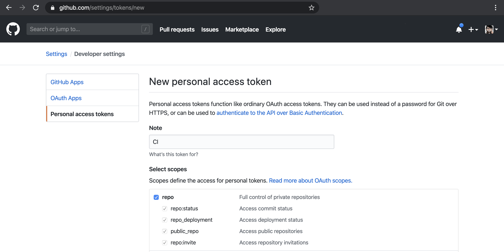
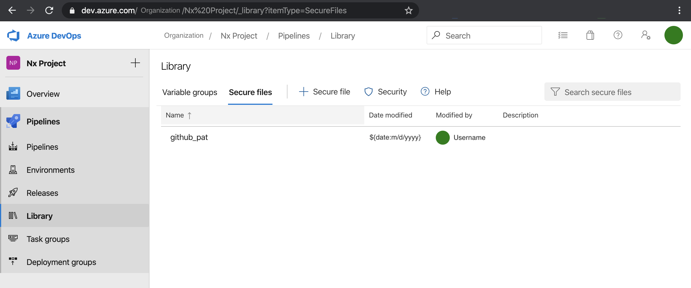
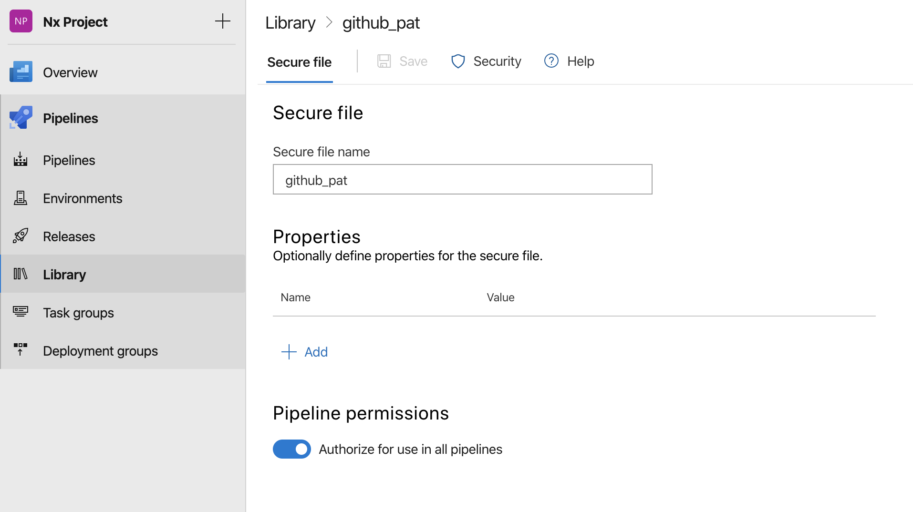

[⬅️ Build and Release Flow](README.md)

[⬅️ README](../../README.md)

# Create and use a GitHub PAT

> PAT - personal access token

Since that in the build flow I'm using auxiliaries branches to host the build output from the applications inside of the mono repository. To be able to use the Node Module [gh-pages](https://github.com/tschaub/gh-pages) to help with the tasks, since it's running outsite of the current repo folder on the Azure DevOps server we'll need to use another way to authenticate and be able to push the code to the GitHub repository.

## Steps

- create a GitHub PAT

  - add the rights to repo only

  - once it's showed on the screen, save it somewhere to be readded later (a txt file on your cloud account, like Google Drive, Dropbox, 1password, or any other), because it's only showed right after you create the token



- get the token and place it inside of a text file without any extension `github_pat`

```bash
echo "${GITHUB_PAT_TOKEN_STRING}" > github_pat
```

- upload the file `github_pat` to the Azure DevOps project Pipelines > Library > Secure files



- edit the `github_pat` file and change its permission to `Authorize for use in all pipelines`



## Further help

- [Creating a personal access token for the command line | GitHub Help](https://help.github.com/en/github/authenticating-to-github/creating-a-personal-access-token-for-the-command-line)

  - [GitHub PATs | GitHub Developer Settings](https://github.com/settings/tokens)
